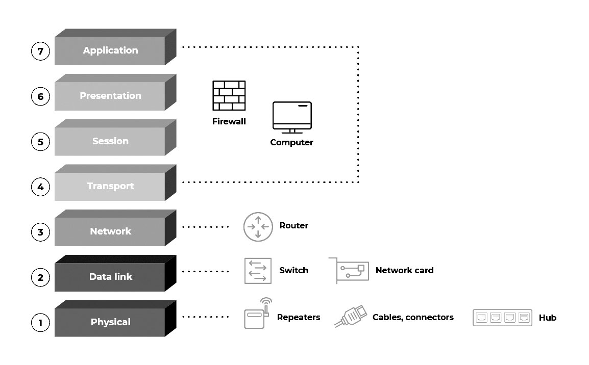
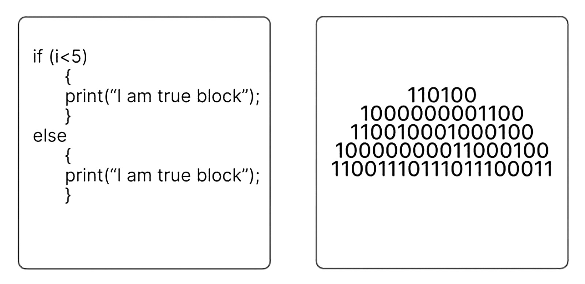
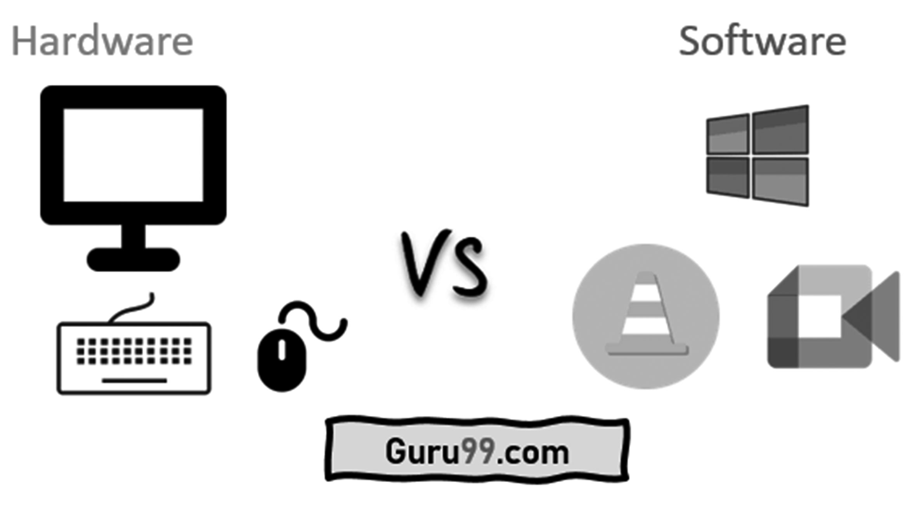
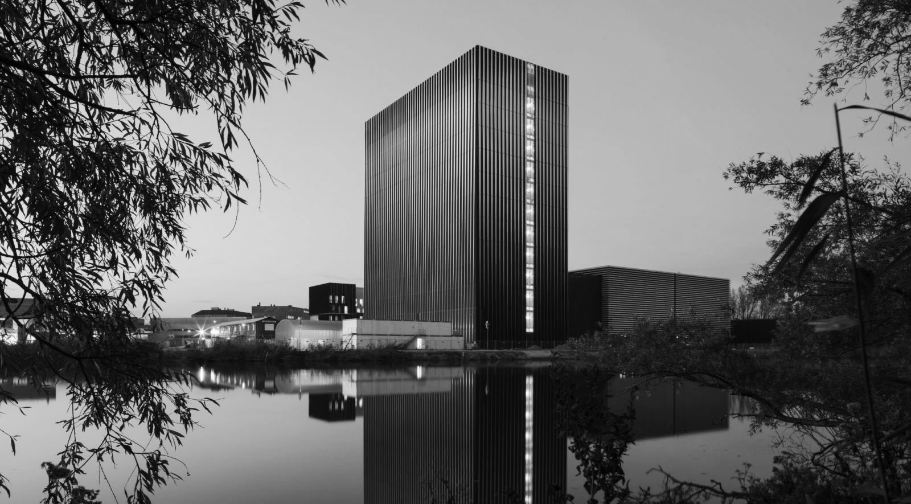
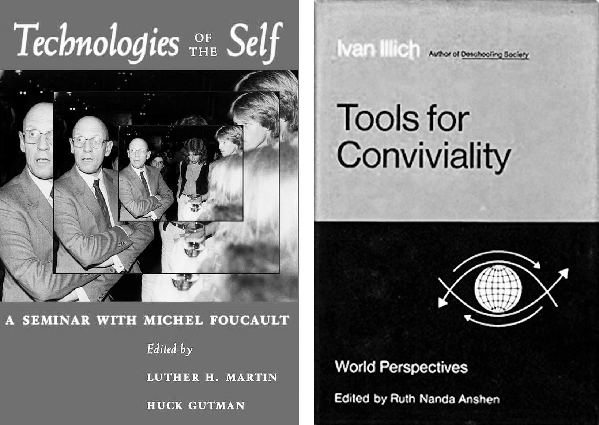
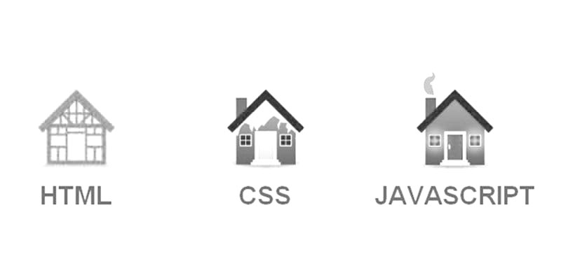

# Prelude

_Coding Y1 @ KABK_
_(inter)dependencies_

For this semester, I’d propose we start by extrapolating ourselves from the technicalities of ‘coding’ and have a look at our surroundings. 

Although I’m not a fan of the saying that ‘code is every­where’ or ‘everything is code’, I find the optical point of view it provides when it comes to look at our surroundings stimulating. ‘Thinking code’ shapes our way of looking at things, and provides abstraction models that help interpreting the materiality of our environment.

I’d like to think about how elements tend to sit on other elements, that every piece of the puzzle that fulfills a function depends on another piece that fulfills another function and so on and so on. 

_The 7 layers of the Open Systems Interconnection (OSI) model, a model for systems interconnection._

 

Programming languages each operate within different abstraction layers. In the case of this course, we’ll touch mostly on web programming. This type of ‘high level programming’ language depends on the web browser that decodes the program, itself running (and programmed) within an operating system, itself programmed to run through unified hardware elements, which themselves run via embedded small programs. These hardwares run on communication networks and electric grids. 

_High level programming vs. low level programming_

 

_Hardware vs. software_

 

These various technological layers interacting and complementing each other, with their sheer complexity yet smooth outcomes, abstracts themselves from our view. And analogies between technology and magic keep coming back. 

_Any sufficiently advanced technology is indistinguishable from magic. 
—Arthur C. Clarke_

 

In a way, our world is a collection of interdependent functions, ecosystems, ecologies, technologies, techniques. Thinking about the resources and infrastructure necessary to turn on the light, read an email, drink water, eat an apple… And regarding technology, thinking about how this gets very physical with power plants producing energy, the grid transporting and ‘balancing’ it, interconnection stations, and underwater cables connecting worldwide data centers, which produce heat and must be cooled.

_The internet is real... Datacenter AM4 (Equinix), designed by Benthem Crouwel,Amsterdam, NL_

 

And of course technologies can also be social and political ‘immaterial’ concepts with a real material impact. Of course language itself is a technology (written, spoken, visual, gestual). Everything is technology.

_Michel Foucault (left) wrote a lot on ‘social’ technologies and power, while Ivan Illich (right) advocated for new ‘convivial’ uses of technology_

 

But, as well, thinking about the ecological infrastructure embedded in rhizomatic networks of underground roots sustaining a forest, in bees reproducing nature by feasting on nectar, in how water evaporating turns into rains and other meteorological phenomena, and so on.

_Pando, the world’s largest tree, is a quaking aspen tree in Utah, United States.  A male clonal organism, Pando has an estimated 47,000 stems (ramets) that appear as individual trees, but are connected by a root system that spans 106 acres._

 

_Honey bee colonies have a complex social organization and an important ecological function_

 

Here is a usual analogy used in web development when talking about coding languages: the house.

Elements are…

1) The house’s foundation and structure, HTML. 
(if the HTML is not ‘semantic’ and sturdy, 
the house is unstable).

2) 	The coat of painting, the appearance, 
the cosmetic, CSS.

3) 	A kitchen, appliances, sinks, electric sockets, 
a ventilation system, elements that provided added functionality: Javascript.

_The house analogy_

In code, there is rarely a finished product. Only iterations of something that lives, that is live. And code is never 
truly self-contained. Code depends on other code, depends on other technological layers, sits on layers 
on layers on layers.

 

2024/09/09  
François Girard-Meunier  
KABK, Den Haag
