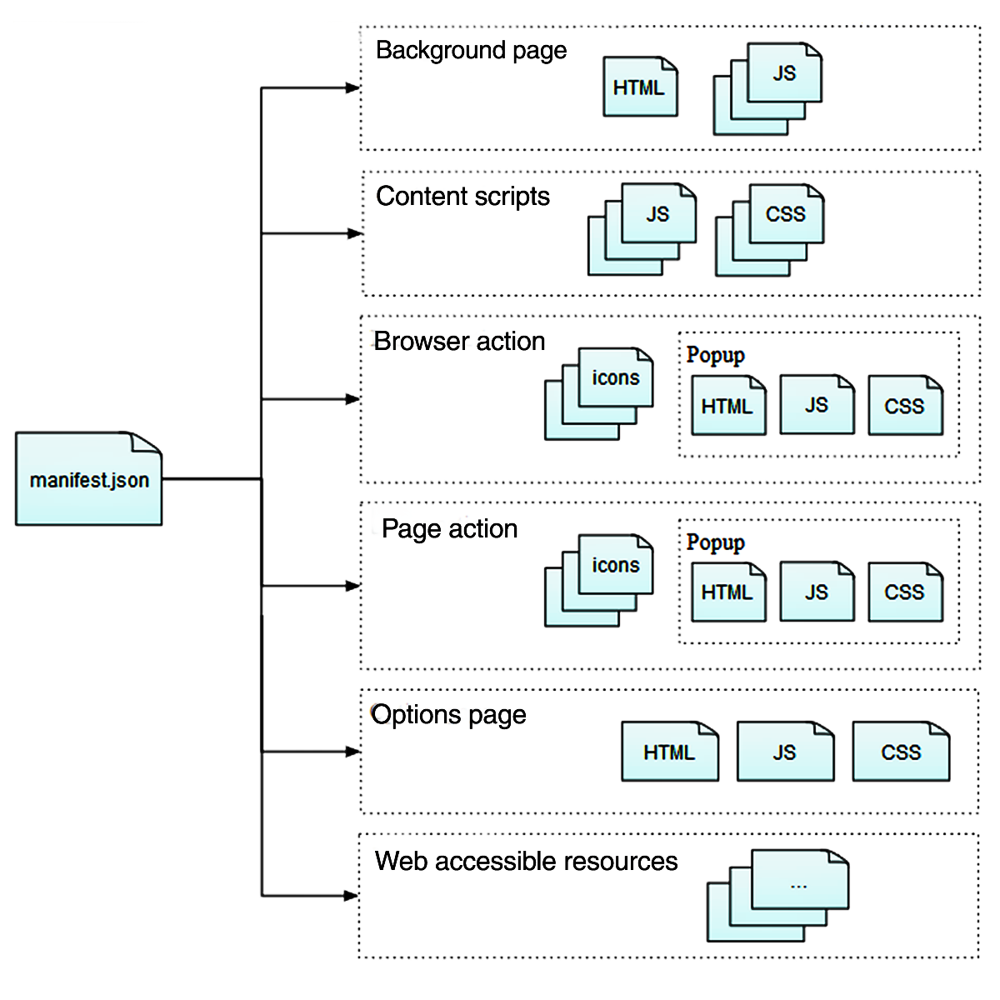
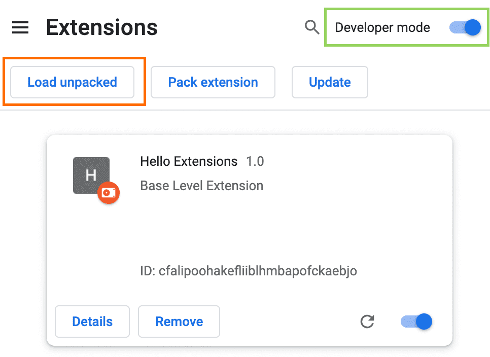
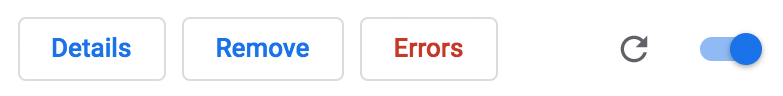

# Class 9, 2025/03/31

## Tutorial: web extension starter kit (2h)

1) Create a folder named `my-extension-project`.
2) Create your `manifest.json` file inside your project folder.

Add this in your file:

```
{
    "manifest_version": 3,
    "name": "My extension project",
    "description": "My extension description",
    "version": "1.0",
    "icons": {
      "16": "images/icon/icon.png",
      "32": "images/icon/icon.png",
      "48": "images/icon/icon.png",
      "128": "images/icon/icon.png"
    },
    "action": {
        "default_icon": {
            "16": "images/icon/icon.png",
            "32": "images/icon/icon.png",
            "48": "images/icon/icon.png",
            "128": "images/icon/icon.png"
        }
    },
    "content_scripts": [
        {   
            "matches": [
                "<all_urls>"
            ],
            "js": ["script.js"],
            "css" : ["style.css"]
        }
    ]
}
```

The `manifest.json` is an essential file for your project. A bit like the `head` of your HTML document, it provides metadata regarding your project.

In this example, we linked a `script.js` and `style.css` file, these apply to **all** URLs visited by us. By changing the value of `matches` or setting an `exclude_matches` name/value, we can choose which URLs apply our scripts and styles. We can also offer different stylesheets based on different URLs. See the full documentation on [manifest.json on the MDN website](https://developer.mozilla.org/en-US/docs/Mozilla/Add-ons/WebExtensions/manifest.json).

Examples with matches:

```
            ...
            "matches": [
                "https://www.theguardian.com/*",
                "https://www.hetparool.com/*"
            ],
            "exclude_matches": [
                "https://www.theguardian.com/help/terms-of-service"
            ],
            ...
```

...applies to the two websites mentionned in *matches* (the `*` is called a *wildcard*, and it means that all URLs after the slash will work as well), but excludes a specific terms-of-service subpage.

If you are using files in your project (webfonts, images), they need to be preconnected within your manifest.json file by using the `web_accessible_resources` key.

```
    ...
    "web_accessible_resources": [
        "images/my-image.png",
        "images/my-image-2.png",
        "fonts/my-font.woff2",
    ]
    ...
```

3) Create a new file named `scripts.js`, located in the root of your `my-extension-project` folder.
4) Create a new file named `style.css`, located in the root of your `my-extension-project` folder.
5) Create a `images` folder in the root of your `my-extension-project` folder. Create an `icon` folder inside this new `images` folder. Inside that `icon` folder, drop a file called `icon.png`.

## Extension structure, a primer

Previously, we created a manifest.json file as well as other files that we refered to in our manifest. An extension might use several ressource files, which should be located within your extension folder and can be categorized as such:

- **Background scripts**: Scripts that respond to browser events.
- **Icons**: for the extension and any buttons it might define.
- **Sidebars, popups, and options pages**: HTML documents that provide content for various user interface components.
- **Content scripts**: JavaScript included with your extension, that you will inject into web pages.
- **Web-accessible resources**: make packaged content accessible to web pages and content scripts.



Read more on [Anatomy of a Web Extension, on the MDN website](https://developer.mozilla.org/en-US/docs/Mozilla/Add-ons/WebExtensions/Anatomy_of_a_WebExtension).

## Installing and debugging your web extension

**Load an unpacked extension**

1) Go to: `chrome://extensions/` (type this in your Chrome browser's address bar), **or** click on the **Extensions** menu puzzle button and select **Manage Extensions**, **or** click on **Window**, and **Extensions**.
2) Activate the **developer mode** (toggle switch on the top right of the window)
3) Click on the **Load unpacked** button
4) Locate and select the folder of your extension (`my-extension-project`).



**Pin the extension**

By default, when you load your extension locally, it will appear in the extensions menu (Puzzle). Pin your extension to the toolbar to quickly access your extension during development.

**Reload the extension**

In order to **view** the changes you make to your extension files, you not only need to **save** your changes, but you also need to **reload** your extension (in addition to the webpage you're at). In order to do so, you need to click on the **`↻`** button.

**Debug the extension**

When errors are logged, they will appear under a red **Error** button located next to the **Details** and **Delete** buttons. Click on that button and you can see a log with the parts of your code that are causing issues.



This is how a debugging log will look like:


You can also install the `web-ext` command-line tool (with Terminal on Mac, or Command Prompt on Windows). This will allow the browser extension to automatically refresh itself. Read more and install instructions on [Firefox Extension Workshop](https://extensionworkshop.com/documentation/develop/getting-started-with-web-ext/).

**Use the JavaScript `console` for debugging**

To use the **console** (in **developer tools**) from within the content script, click the dropdown arrow next to `top` and select the extension.


## Extensions, basic CSS and JS actions

1) Quick styling demonstration:
   - Change the font of the whole document.
   - Add content before and after titles.
   - Add various stylings (change color, background color, etc).
   - Use the developper tool to target elements on a webpage and styling it differently.
  
2) Use JavaScript to inject basic HTML elements and add new functions to the page:
   - CreateElement, innerHTML.
   - Create a click function that hides text when clicked on it.

### The difference between a variable with a *number* value, a *zero* value, an *empty* value, and being *undefined*?


## Extensions, further ressources:

🚨 To do 🚨

https://developer.chrome.com/docs/extensions/get-started/tutorial/scripts-activetab?hl=en

https://developer.chrome.com/docs/extensions/get-started?hl=en

https://developer.mozilla.org/en-US/docs/Mozilla/Add-ons/WebExtensions/Examples

## *Web intervention* assignment time, small group talks, sign-up sheet

| Time slot (25min per group) | Student |
| -- | -------------- |
| 15h25 | –, –, –, –, – |
| 15h50 | –, –, –, –, – |
| 16h15 | –, –, –, –, – |
| 16h40 | –, –, –, –, – |
| 17h05 | –, –, –, – |

