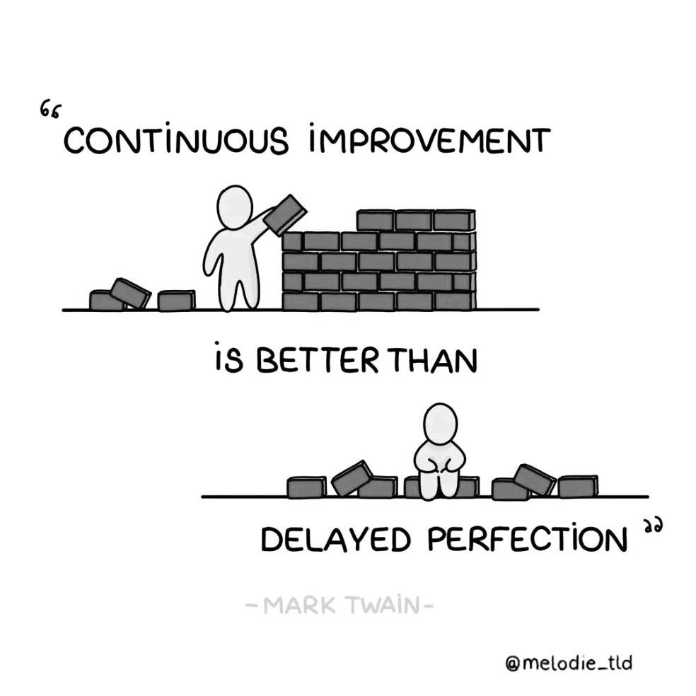

# Coding Y1A @ KABK, 2024–2025

*(inter)dependencies*

## The course

During this semester, we will unbox basics about coding, with a focus on the ‘web’ triad of HTML/CSS/Javascript. While doing so, we will keep a certain approach in mind, which is to foster ways of ‘thinking through coding’ optics. This means understanding how languages and their syntax systems work and the aspect and logic behind writing code. Via presentation and exercises, we will apply this logic conceptually without aiming too much at the technicalities of a production-proof code. Besides that, 
we will also look, and learn to look and talk about web experiences (in visual as well as navigational terms, 
taking all dimensions into account).

## Main assignments

In addition to in-class exercises, you will have 3-4 short assignments, each to be completed in a 2-3 weeks period. These assignments, building one on top of each other, will result in a common compendium of ‘poetic’, interconnected web pages. Ultimately, we can see this class as a space where each student, catering to their own ‘web space’ patch, together contribute to the growing and flourishing of a (web-based) garden, or community of mutually, somewhat interdependent virtual web spaces.

## Small presentation assignment

*At the beginning of each class, 2 students will make a short presentation about a website they like, and tell us a bit more about it. I will also do the same.*

[A website you like, read more on the assignment page](https://github.com/francois-gm/go-kabk-y1a/tree/main/01-2%20-%20Assignment%2C%20A%20Website%20I%20Like)

## Time schedule

Every monday, 13h30-17h30, PD.205

First 15 minutes: web culture  
Small presentation assignment, I present and you present

2h-ish: presentations, workshop-based  
1h30-ish: exercices and class time for assignment

**Teaching methods, assessment methods,
competencies, etc**:  [See ECTS table here](https://denhaagkabk-my.sharepoint.com/:x:/g/personal/f_girard-meunier_kabk_nl/EZyFrnFEOdFBtG2cfrBLhGYB4j_aEfZXs8XxJUmyKYhLog?e=mcim5P).

## Contact hours

I try to reply to your emails with flexibility, but sometimes it might take a few days (esp. if you email me during mid-week as our class is on Monday)

- Available by email via: f.girard-meunier@kabk.nl
- And also on Teams

